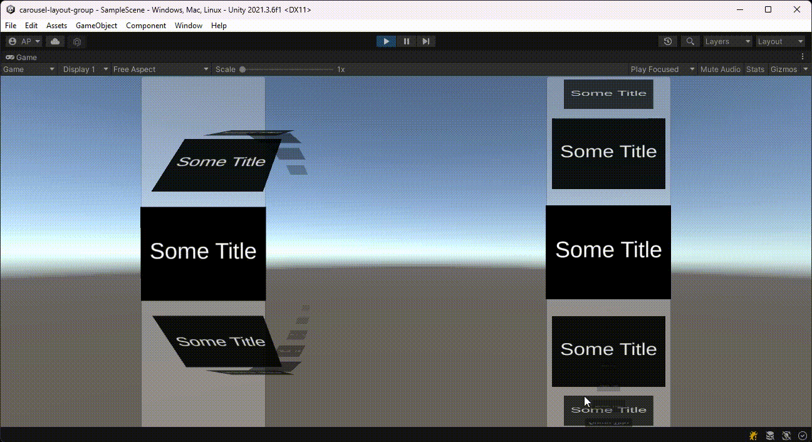
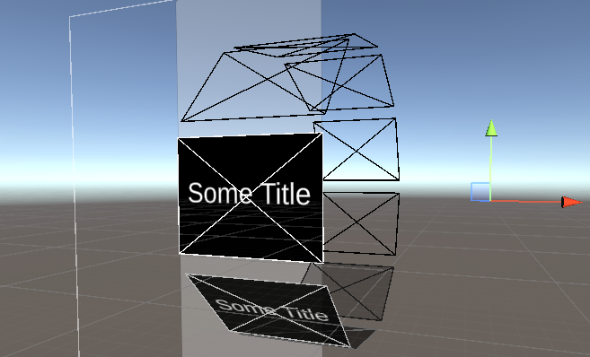
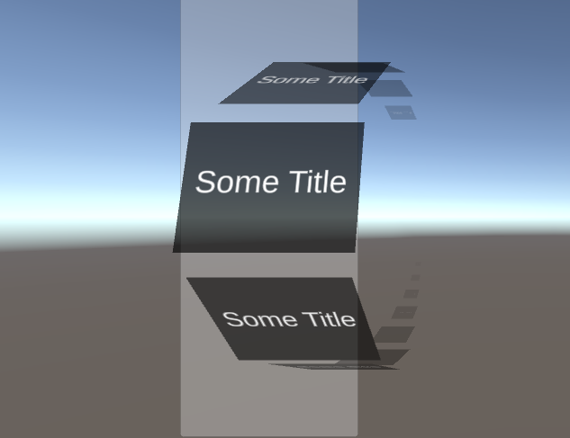
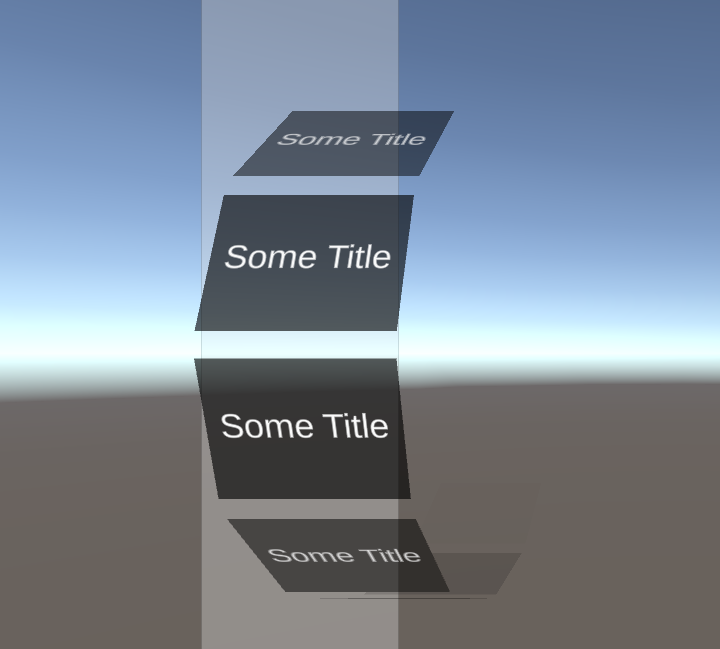

# carousel-layout-group

<b>Other Showcases<b>

<Header><b>Overview</b></Header>
The project contents contains the code nessesary to generate a extendable 3D carousel within Unity's UGUI system. This project provides provide the following features:

- Layout Functionality
    - The organize elements in a radial pattern
        - Elements don't need to be uniform in size
        - Spacing between elements
        - Adjustable Radius Scale
        - Invert element display pattern
        - Reverse arrangement of child elements
    - A place to customize the Dynamic style of displayed elements  
- Scroll View Functionality
    - Recieve and handle input for both Drag and Scroll events
    - Multiple Movement types
        - Elastic
        - Clamped 
        - Unrestricted
    - Single Element Focus
        - The ability to set the focused child element from a transform
        - The ability when scrolling to snap the the closest child element
- Editor Support
    - Gizmo's to preview empty element space's in scene view

<Header><b>Contents</b></Header>
The relevant files can be located in the following directory's

- CarouselLayoutGroup.cs
    - ./Assets/Scripts/CarouselLayoutGroups.cs
- UI-Z_order.shader
    - ./Assets/Scripts/UI-Z_order.shader

<Header><b>Quick Start</b></Header>

1. Create a Panel on a Canvas in Unity
1. Attach CarouselLayoutGroup in Unity
1. Create an Image as a child of the panel named "Item (0)"
1. Create a custom material called "UI-Z_Order" and set its shader to use UI/UI-Z_Order
    - This will allow the Unity to properly render overlapping child elements by writing to the depth buffer.
1. Apply the "UI-Z_Order" material to "Item (0)"'s image component
1. Attach a 'Canvas Group' component to "Item (0)"
1. Duplicate "Item (0)" a few times
1. Press play and and interact with Carousel

<Header><b>How do I customize the Dynamic Style of displayed elements</b></Header>

1. Open CarouselLayoutGroup.cs with code editor of choice
1. Navigate to the function named "FormatChild"
1. Make desired changes

Here is an example of what could be done to make changes to the FormatChild Function
    
    private void FormatChild(float theta, ChildItem child)
    {
        if (Alpha) 
        {
            var alpha = GetAlpha(theta); //the alpha represents the visiblity of an element
            var canvasGroup = child.transform.GetComponent<CanvasGroup>();
            if (canvasGroup)
            {
                canvasGroup.alpha = alpha;

                //make element only interactable if the object is visible
                canvasGroup.blocksRaycasts = alpha > 0;
            }
            child.transform.localScale = new Vector3(alpha, alpha, alpha); //use the alpha value to adjust the scale of the child elements.
        }
    }
